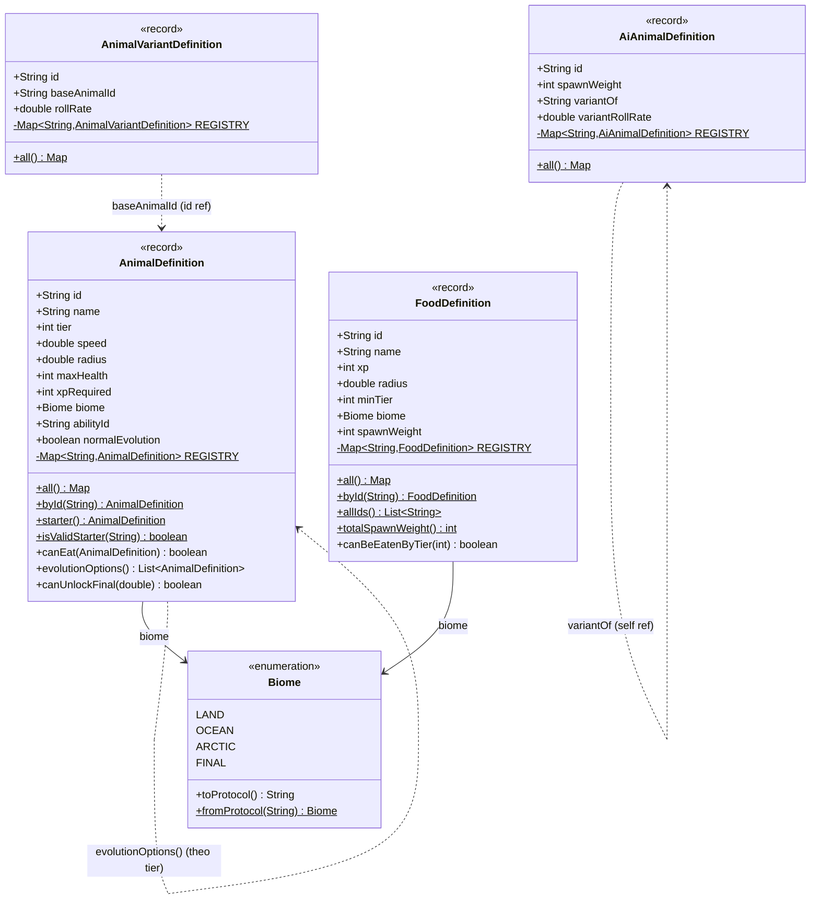
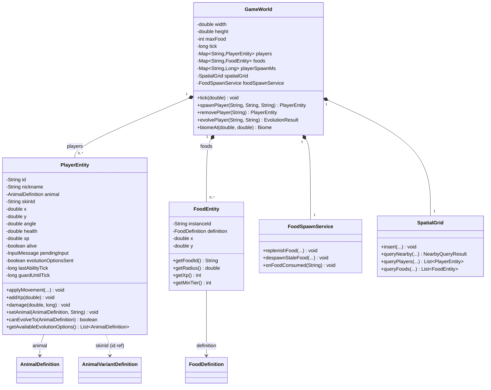
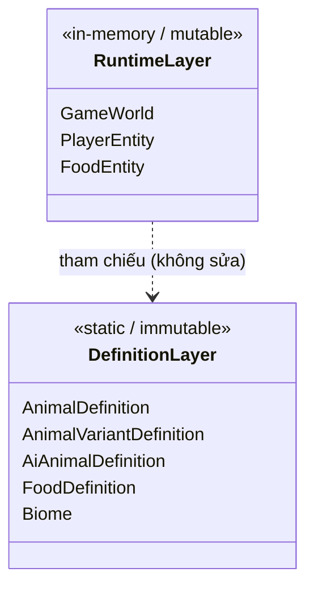

# Mô hình dữ liệu Backend (Mimope Server)

> Tài liệu này mô tả cách backend lưu trữ dữ liệu và quan hệ giữa các model.
> Vì hệ thống là **in-memory / stateless về mặt persistence**, sơ đồ được thể
> hiện dưới dạng **class diagram** (phù hợp với mô hình OOP) thay vì ERD.

## 1. Tổng quan: Backend lưu trữ dữ liệu thế nào?

**Backend KHÔNG dùng database.** Sau khi kiểm tra `pom.xml`, không có bất kỳ
dependency nào liên quan tới lưu trữ dữ liệu bền vững:

- Không có `spring-boot-starter-data-jpa`, `spring-boot-starter-jdbc`
- Không có driver DB (PostgreSQL, MySQL, H2, MongoDB, Redis...)
- Không có cấu hình `datasource` trong `application.yml`

Các dependency thực tế chỉ gồm: `web`, `websocket`, `actuator`, `validation`, `test`.

Dữ liệu được phân thành 2 nhóm, đều nằm **trong bộ nhớ (in-memory)**:

| Nhóm | Bản chất | Vòng đời | Nơi lưu |
|------|----------|----------|---------|
| **Dữ liệu tĩnh (Definitions)** | Cấu hình hardcode trong code Java (static `REGISTRY`) | Bất biến, tồn tại cùng ứng dụng | `game/data/*.java` |
| **Dữ liệu động (Runtime state)** | Trạng thái game thời gian thực | Mất khi server tắt / player rời | `ConcurrentHashMap` trong `GameWorld` |

Nói cách khác: dữ liệu "tra cứu" (loài, thức ăn, biến thể) là các Java `record`
bất biến được nhúng cứng trong source; dữ liệu "chơi" (player, food instance)
là các object sống trong RAM, đồng bộ tới client qua WebSocket snapshot chứ
không ghi xuống ổ đĩa.

## 2. Class diagram

### 2.1 Định nghĩa tĩnh (Definition layer — `game/data`)

Các `record` bất biến, mỗi loại giữ một static `REGISTRY : Map<String, T>`
đóng vai trò master data. Khóa tra cứu luôn là `id`.

### 2.2 Runtime state (Entity layer — `game`)

Các object mutable/immutable sống trong bộ nhớ, được `GameWorld` sở hữu và
`GameLoop` cập nhật mỗi tick.

### 2.3 Liên kết giữa 2 layer

## 3. Chú thích quan hệ

| Ký hiệu | Ý nghĩa |
|---------|---------|
| `*--` (composition) | `GameWorld` sở hữu `PlayerEntity` / `FoodEntity`; entity mất khi world/player kết thúc |
| `-->` (association) | Tham chiếu trực tiếp tới object khác (ví dụ `PlayerEntity.animal`) |
| `..>` (dependency) | Tham chiếu "mềm" qua `String id` (ví dụ `skinId`, `variantOf`, `baseAnimalId`) hoặc suy diễn logic |

## 4. Lưu ý

- Hệ thống **stateless về mặt lưu trữ**: không có bảng nào persist xuống disk/DB.
- Toàn bộ khóa tra cứu ở definition layer đều là `String id`.
- `PlayerEntity.skinId` có thể trỏ tới `AnimalDefinition.id` (skin mặc định)
  hoặc `AnimalVariantDefinition.id` (skin biến thể) — do đó thể hiện là quan hệ
  dependency qua chuỗi id chứ không phải association cứng.
- Các event (`FoodPickupEvent`, `DeathEvent`, `AbilityEvent`,
  `EvolutionOptionsEvent`) chỉ là dữ liệu tạm trong một tick, không lưu trữ, nên
  không đưa vào sơ đồ chính.
